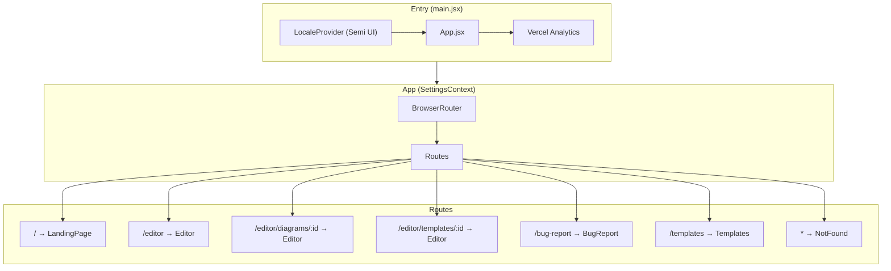
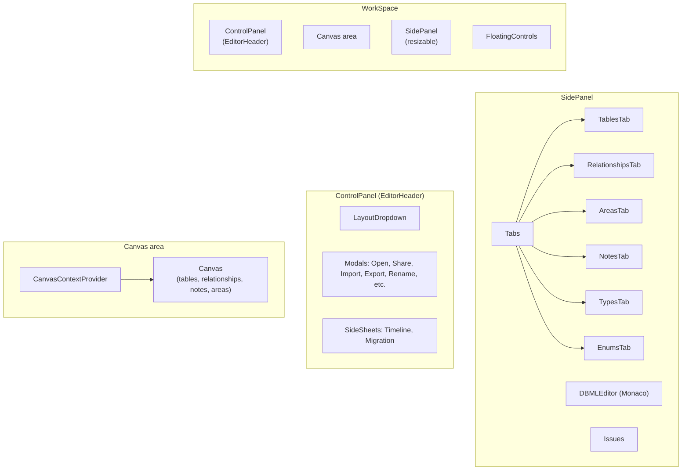
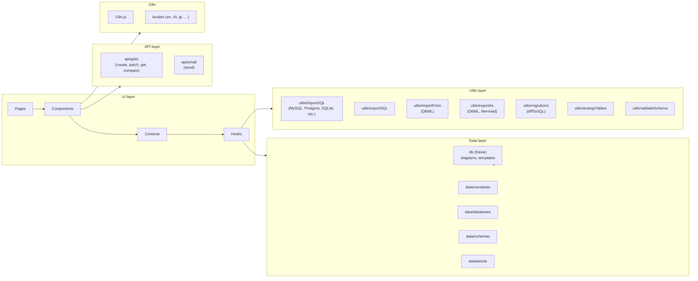
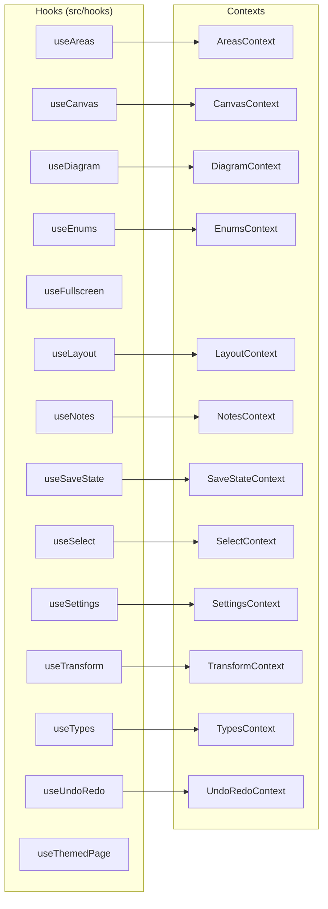

# DrawDB Codebase Diagram

A React + Vite app for designing database ER diagrams. Below are architecture and structure diagrams.

---

## 1. Entry & routing



---

## 2. Editor context stack (innermost = closest to UI)

Context providers wrap the editor; order matters for dependencies.

```mermaid
flowchart LR
  subgraph outer["Outer (layout & transform)"]
    LayoutContext["LayoutContext"]
    TransformContext["TransformContext"]
  end

  subgraph state["State & history"]
    UndoRedoContext["UndoRedoContext"]
    SelectContext["SelectContext"]
  end

  subgraph domain["Domain (diagram entities)"]
    AreasContext["AreasContext"]
    NotesContext["NotesContext"]
    TypesContext["TypesContext"]
    EnumsContext["EnumsContext"]
    DiagramContext["DiagramContext\n(tables, relationships, DB)"]
  end

  subgraph persistence["Persistence"]
    SaveStateContext["SaveStateContext"]
  end

  subgraph ui["UI"]
    WorkSpace["WorkSpace"]
  end

  LayoutContext --> TransformContext --> UndoRedoContext --> SelectContext
  SelectContext --> AreasContext --> NotesContext --> TypesContext --> EnumsContext
  EnumsContext --> DiagramContext --> SaveStateContext --> WorkSpace
```



---

## 3. Workspace composition



---

## 4. Data & external layers



---

## 5. Hooks ↔ contexts



---

## 6. Directory tree (main areas)

```
src/
├── main.jsx              # Entry: LocaleProvider, App, Analytics
├── App.jsx                # SettingsContext, Router, Routes
├── index.css
├── pages/                 # Route targets
│   ├── Editor.jsx         # Context stack + WorkSpace
│   ├── LandingPage.jsx
│   ├── Templates.jsx
│   ├── BugReport.jsx
│   └── NotFound.jsx
├── context/               # React contexts (see diagram 2)
├── hooks/                 # useDiagram, useCanvas, useLayout, …
├── components/
│   ├── Workspace.jsx      # ControlPanel, Canvas, SidePanel, FloatingControls
│   ├── EditorHeader/      # ControlPanel, Modals, SideSheets, LayoutDropdown
│   ├── EditorCanvas/      # Canvas, Relationship, Table, Note, Area
│   ├── EditorSidePanel/   # SidePanel, Tabs, DBMLEditor, Issues
│   ├── LexicalEditor/     # RichEditor, ToolbarPlugin, plugins
│   ├── CodeEditor/       # Monaco + DBML setup
│   └── SortableList/      # DnD list
├── data/                  # db (Dexie), constants, databases, schemas, seeds
├── api/                   # gists, email
├── utils/                 # importSQL, exportSQL, importFrom, exportAs, migrations, …
├── i18n/                  # i18n.js, locales/
├── templates/             # template1..6, seeds
├── animations/
├── icons/
└── assets/
```

---

## Summary

| Layer        | Purpose |
|-------------|---------|
| **App**     | Settings, router, route definitions. |
| **Editor**  | Nested contexts for layout, transform, undo/redo, selection, areas, notes, types, enums, diagram (tables/relationships), save state. |
| **WorkSpace** | Header (ControlPanel), canvas (Canvas + CanvasContext), resizable SidePanel (tabs + DBML editor), floating controls. |
| **Data**    | Dexie DB (diagrams, templates), constants, DB configs, JSON schemas. |
| **API**     | GitHub Gists (create/patch/get/compare), email. |
| **Utils**   | SQL import/export per dialect, DBML/Mermaid, migrations, validation, layout (arrangeTables). |
| **i18n**    | react-i18next + many locales. |
